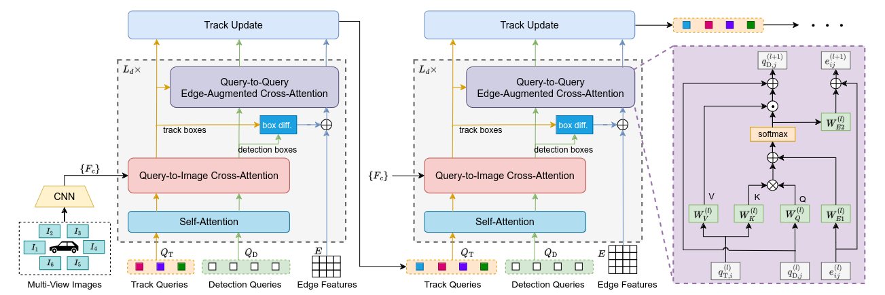

# [CVPR2024] ADA-Track: End-to-End Multi-Camera 3D Multi-Object Tracking with Alternating Detection and Association

This is the official implementation of the CVPR'24 paper
> **ADA-Track: End-to-End Multi-Camera 3D Multi-Object Tracking with Alternating Detection and Association**  
> Shuxiao Ding, Lukas Schneider, Marius Cordts, Juergen Gall

[Arxiv (CVPR version)](https://arxiv.org/abs/2405.08909v1) | [CVF Open Access](https://openaccess.thecvf.com/content/CVPR2024/html/Ding_ADA-Track_End-to-End_Multi-Camera_3D_Multi-Object_Tracking_with_Alternating_Detection_and_CVPR_2024_paper.html) | [Arxiv (Extended version)](https://arxiv.org/abs/2405.08909v2) 

https://github.com/dsx0511/ADA-Track/assets/33251274/35a46ef9-a2c9-4c26-beb8-3246438004a0

## Abstract
Query-based 3D Multi-Object Tracking (MOT) facilitates seamless integration into end-to-end frameworks. Many existing methods adopt the tracking-by-attention paradigm, utilizing track queries for identity-consistent detection and object queries for identity-agnostic track spawning. Tracking-by-attention, however, entangles detection and tracking queries in one embedding for both the detection and tracking task, which is sub-optimal. Other approaches resemble the tracking-by-detection paradigm, detecting objects using decoupled track and detection queries followed by a subsequent association. These methods, however, do not leverage synergies between the detection and association task. Combining the strengths of both paradigms, we introduce ADA-Track, a novel end-to-end framework for 3D MOT from multi-view cameras. We introduce a learnable data association module based on edge-augmented cross-attention, leveraging appearance and geometric features. Furthermore, we integrate this association module into the decoder layer of a DETR-based 3D detector, enabling simultaneous DETR-like query-to-image cross-attention for detection and query-to-query cross-attention for data association. By stacking these decoder layers, queries are refined for the detection and association task alternately, effectively harnessing the task dependencies. We evaluate our method on the nuScenes dataset and demonstrate the advantage of our approach compared to the two previous paradigms.

 

## News
- [2024/12/13] We release an extended version, ADA-Track++. The arxiv paper can be accessed [here](https://arxiv.org/abs/2405.08909v2).
- [2024/02/26] Our paper is accepted by CVPR 2024! 🎉🎉
- [2024/05/14] We release our source code.

## Getting started
1. [Installation](./docs/installation.md)
2. [Data preparation](./docs/data_prep.md)
3. [Training & inference](./docs/train_and_inference.md)

## Experimental results

| Detector | Backbone | N_GPU | AMOTA | AMOTP | Logfile | Checkpoint |
|---|---|---|---|---|---|---|
| [DETR3D](./plugin/configs/ada_track_detr3d.py) | ResNet-101 | 4 | 38.4 | 1.378 | [log](./training_logs/ada_track_detr3d.json) | [Download](https://drive.google.com/file/d/1Q7xbilpKjQ2fIledBji16JsuVJ887nxF/view?usp=drive_link) |
| [PETR](./plugin/configs/ada_track_petr.py) | V2-99 | 8 | 48.3 | 1.242 | [log](./training_logs/ada_track_petr.json) | [Download](https://drive.google.com/file/d/1xZDDQ_Z7-BcFfnwOIwDOpLWPGhElHKjb/view?usp=drive_link) |

NOTE: After fixing a small issue in the code, we achieved slightly better performance than reported in the paper ;-)

## License
See [LICENSE](./LICENSE) for more details.

## Citation
If you find ADA-Track is helpful for your research, please give us a star and cite it by:
```
@inproceedings{ding2024adatrack,
  title={ADA-Track: End-to-End Multi-Camera 3D Multi-Object Tracking with Alternating Detection and Association},
  author={Ding, Shuxiao and Schneider, Lukas and Cordts, Marius and Gall, Juergen},
  booktitle={Proceedings of the IEEE/CVF Conference on Computer Vision and Pattern Recognition (CVPR)},
  year={2024}
}
```

## Acknowledgement
Our implementation is a plugin to [mmdetection3d](https://github.com/open-mmlab/mmdetection3d), and it is highly dependent on [MUTR3D](https://github.com/a1600012888/MUTR3D). 
We build our tracker based on the implementation of the detectors [DETR3D](https://github.com/WangYueFt/detr3d) and [PETR](https://github.com/megvii-research/PETR).
The success of this work is impossible without these aforementioned projects as well as many other high-quality open-source projects.
Many thanks to them for enabling our research!
